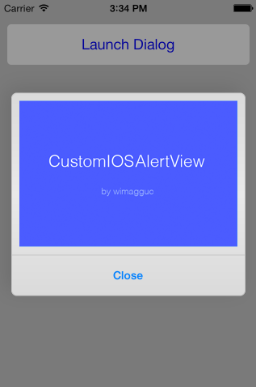

# Custom iOS7 AlertView

`v0.1`

The addSubview is not available in UIAlertView in iOS7 any more. The view hierarchy for this class is private and must not be modified.

As a solution, this class creates an iOS7-style dialog which you can extend with any UIViews or buttons. The animations and the looks are copied too and no images or other resources are needed.



## Install

As simpel as adding the following files to your project:

* CustomIOS7AlertView.h
* CustomIOS7AlertView.m

## Usage

1. Create the UIView object. (Passing the whole parent view, because some calculations are needed: the dialog comes in the middle etc.)

    ```
    CustomIOS7AlertView *alertView = [[CustomIOS7AlertView alloc] initWithParentView:self.view];
    ```
  
2. Add some custom content to the alert view

    ```
    UIView *customView ..;

    [alertView setContainerView:customView];
    ```

3. Display the dialog

    ```
    [alertView show];
    ```

## TODO

This is a really quick implementation, and there are a few things missing:

* Better button overrides: for now, we just add one "Close button" to the bottom of the dialog.
* Better rotation support (works with landscape and portrait mode too, so the current best practise is to re-open the same dialog once the screen is rotated)


## License

Use it as is, show me if you did something cool. Also, feel free to push back anything you think is useful for the project.

## About

Richard Dancsi  
[www.wimagguc.com](http://www.wimagguc.com/)  

twitter: [@wimagguc](http://twitter.com/wimagguc)  
linkedin: [linkedin.com/in/richarddancsi](http://linkedin.com/in/richarddancsi)  
gplus: [plus.google.com/u/0/115939246085616544919](https://plus.google.com/u/0/115939246085616544919)  
